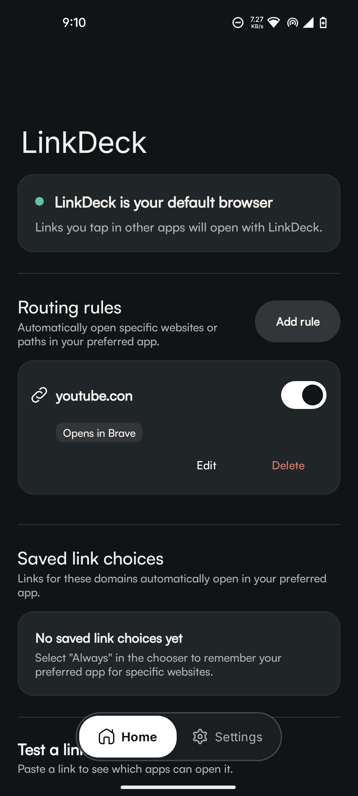
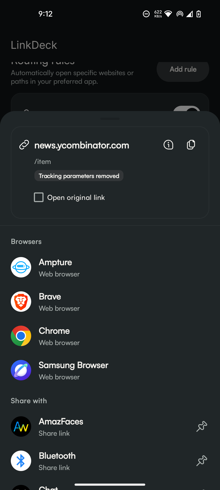
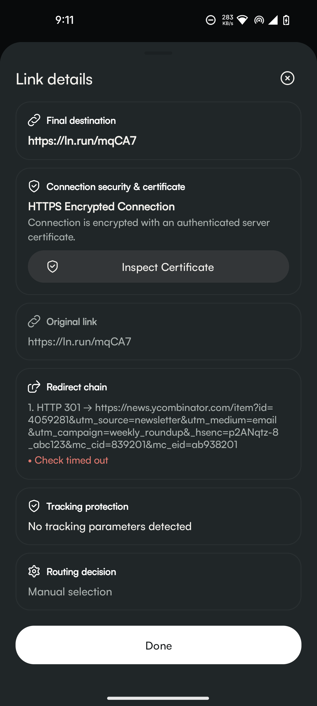
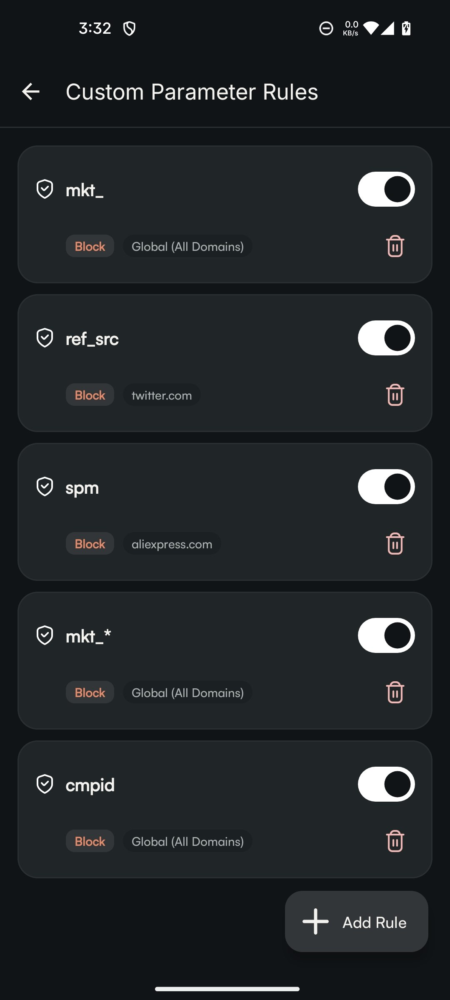
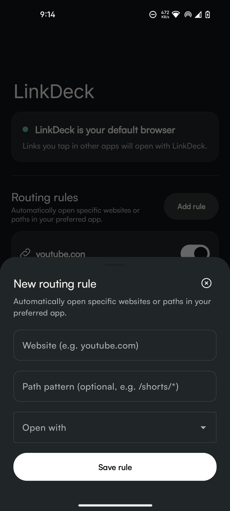
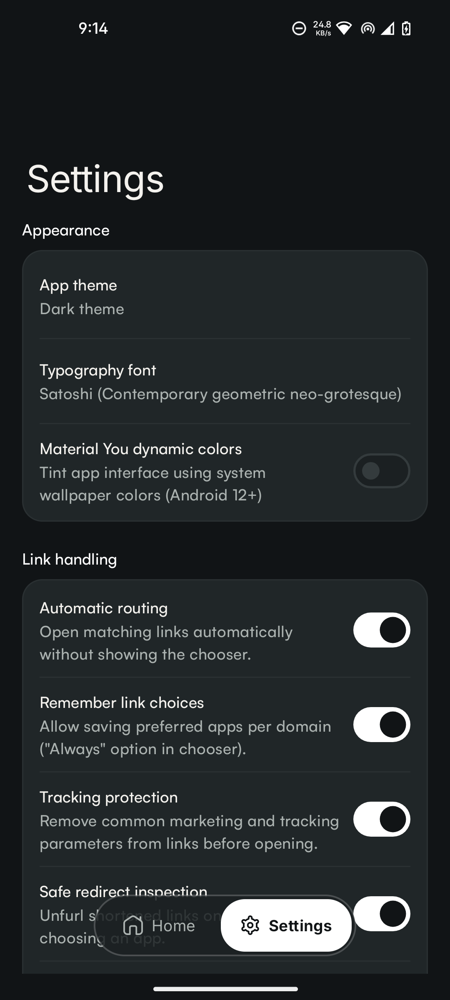

# LinkDeck

<p align="center">
  <strong>Privacy-first, on-device Android link routing companion &amp; default browser proxy.</strong>
</p>

<p align="center">
  <a href="https://github.com/kaunik-chakraborty/LinkDeck/stargazers"></a>
  <a href="LICENSE"></a>
  
  
  
</p>

---

## Table of Contents

- [Overview](#overview)
- [Key Features](#key-features)
- [Privacy & Security Architecture](#privacy--security-architecture)
- [Walkthrough & First-Time Onboarding](#walkthrough--first-time-onboarding)
- [Home Screen Widgets](#home-screen-widgets)
- [System Requirements](#system-requirements)
- [Building & Testing](#building--testing)
- [Screenshots](#screenshots)
- [Community & Policies](#community--policies)
- [License](#license)

---

## Overview

**LinkDeck** acts as your smart, lightweight default browser proxy on Android. Whenever you tap a web link in any chat, social media, or email application, LinkDeck intercepts the request and gives you total control:

1. **Unrolls AMP Links On-Device**: Bypasses Google AMP viewers, AMP Project CDN caches, Cloudflare/Bing AMP caches, and publisher subdomains into direct canonical URLs.
2. **Unfurls Shortened Links On-Device**: Probes redirects (`bit.ly`, `t.co`, `tinyurl.com`, `amzn.to`) locally before opening.
3. **Strips Tracking Parameters**: Removes marketing analytics tokens (`utm_*`, `fbclid`, `gclid`, `msclkid`, `twclid`, `igshid`, `_hsenc`).
4. **Applies Custom Routing Rules**: Opens specific websites or wildcard paths (e.g. `youtube.com/shorts/*`) in your favorite native apps.
5. **Presents a Clean Chooser**: Lets you launch with 1 tap, pin favorite share targets, inspect HTTP hops, or toggle "Always" routing per domain.

---

## Key Features

| Feature | Description |
| :--- | :--- |
| **On-Device De-AMPing Engine** | Automatically unrolls Google AMP viewers (`google.com/amp/s/...`), AMP Project CDN caches (`*.cdn.ampproject.org`), Cloudflare/Bing AMP caches, and publisher subdomains (`amp.reddit.com`) into canonical publisher URLs with zero network calls, immediately unlocking native Android app discovery. |
| **On-Device Redirect Resolver** | Unfurls redirect chains on-device with bounded hop limits, timeouts, and cycle detection. |
| **SSRF & Private Network Shield** | Automatically blocks private IPv4/IPv6 ranges (`127.0.0.0/8`, `10.0.0.0/8`, `192.168.0.0/16`, `169.254.0.0/16`, `fc00::/7`, `fe80::/10`, CGNAT, IPv4-mapped IPv6) and dangerous ports. |
| **Smart Tracking Cleaner** | Strips tracking tags while preserving functional application parameters, percent-encoding, parameter order, and URL fragments. |
| **Deterministic Routing Rules** | Create custom domain and wildcard path rules (`youtube.com/shorts/*`) to automatically route links to preferred apps. |
| **Per-Domain Saved Preferences** | Choose "Always" or "Just once" per domain with runtime package validation and one-tap "Forget" management. |
| **On-Demand TLS Certificate Inspector** | Probes X.509 certificates, TLS protocols (`TLSv1.3`), cipher suites, issuer CA, subject SANs, validity window, and 1-tap copyable SHA-256 fingerprint on-demand. |
| **On-Device Threat & Phishing Heuristics** | Detects Punycode / IDN homoglyph spoofing (`xn--...`), deceptive userinfo credentials, raw IP hosts, and cleartext HTTP with zero cloud calls. |
| **DNS CNAME Cloaking Detector** | Inspects DNS CNAME chains in Link Inspector to uncover third-party tracking networks disguised as first-party subdomains. |
| **Share Sheet Link Cleaner** | Share links directly to LinkDeck from any app (YouTube, Instagram, X) to strip tracking tokens and forward clean links in 1 tap, with an optional toggle to keep original link. |
| **Link Inspector & Redaction** | Inspect redirect hops, HTTP status codes, and routing explanations with sensitive parameter redaction (`token=[redacted]`, `code=[redacted]`). |
| **Material You & Typography** | Full Material Design 3 Monet dynamic wallpaper tinting and 6 curated modern typefaces (Satoshi, Outfit, General Sans, Cabinet Grotesk, Space Grotesk, Plus Jakarta Sans). |
| **Dedicated 2-Tab Features Guide** | Built-in complete guide covering everyday user privacy walkthroughs and in-depth technical security architecture. |
| **Interactive Walkthrough** | Built-in 4-slide onboarding guide for new users, replayable anytime from Settings. |
| **Quick Settings "Clean Clipboard" Tile** | 1-tap dedicated Android Quick Settings tile to sanitize, de-AMP, and strip tracking from your clipboard in-place with instant visual feedback and lock screen safety. |
| **Home Screen Widgets** | Multi-link quick paste widget and status widget for 1-tap clipboard routing from your home screen. |

---

## Privacy & Security Architecture

LinkDeck is engineered with strict local-first security boundaries:

- **100% On-Device Processing**: All link sanitization, redirect resolution, parameter stripping, and rule matching execute locally on your device.
- **Zero Telemetry / Zero Cloud Backend**: No analytics SDKs, crash reporters, tracking pixels, or remote databases.
- **Zero Browsing History**: Inspected URLs and diagnostic logs are ephemeral in-memory objects discarded immediately upon sheet dismissal.
- **No WebView / Remote Code Execution**: LinkDeck contains no `WebView`, JavaScript evaluation engine, or remote HTML parser.
- **Backup Isolation**: Saved rules and preferences are excluded from Android cloud backups via `backup_rules.xml` and `data_extraction_rules.xml`.
- **Minimal Permissions**: Requests only `android.permission.INTERNET` solely for on-device HTTP redirect resolution. Does **not** request `QUERY_ALL_PACKAGES`, Accessibility services, Overlay permissions, or external storage access.

---

## Walkthrough & First-Time Onboarding

LinkDeck includes an interactive 4-slide onboarding guide introducing users to:
1. **Smart Link Companion**: 1-tap direct launch, browser discovery, and pinned share apps.
2. **Clean & Private by Design**: Tracking parameter stripping and safe redirect unfurling.
3. **Automate with Smart Rules**: Custom domain/path rules and per-domain preferences.
4. **Make LinkDeck Your Default**: 1-tap shortcut to set LinkDeck as the Android Default Browser.

*You can replay the walkthrough anytime from **Settings > About > App Walkthrough**.*

---

## Home Screen Widgets & Quick Settings

- **Quick Settings "Clean Clipboard" Tile**: Add LinkDeck's tile to your Android Quick Settings panel to sanitize, de-AMP, and strip tracking parameters from whatever link is in your clipboard with 1 tap, without leaving your active app.
- **Multi-Link & Quick Paste Widget** (`LinkDeckMultiLinkWidget`): Paste and open links instantly from your clipboard, manage quick links, and jump to settings.
- **Status Widget** (`LinkDeckStatusWidget`): Shows current protection status and offers 1-tap diagnostic test shortcuts.

---

## System Requirements

- **Operating System**: Android 10 (API 29) through Android 16 (API 36)
- **Architecture**: 100% Kotlin / JVM bytecode (fully compatible with 16 KB page-size Android 15/16 devices with zero native `.so` dependencies).

---

## Building & Testing

### Prerequisites
- JDK 17
- Android SDK 36

### Build Commands
```bash
# Run complete unit test suite (22 test suites)
./gradlew testDebugUnitTest

# Assemble debug APK
./gradlew assembleDebug

# Assemble optimized release APK
./gradlew assembleRelease
```

---

## Screenshots

<p align="center">
  
  
  
</p>
<p align="center">
  
  
  
</p>

---

## Community & Policies

We welcome contributions! Please review our community and security guidelines:

- **[Contributing Guide](CONTRIBUTING.md)**: Development setup, architectural rules, and pull request guidelines.
- **[Security Policy](SECURITY.md)**: Threat model, security boundaries, and vulnerability reporting.
- **[Code of Conduct](CODE_OF_CONDUCT.md)**: Contributor standards and community pledge.

---

## License

LinkDeck is open-source software licensed under the **[Apache License, Version 2.0](LICENSE)**.

---

<p align="center">
  If you find LinkDeck useful, please consider starring the project on <a href="https://github.com/kaunik-chakraborty/LinkDeck">GitHub</a>!
</p>
